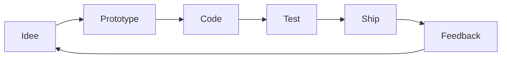

<div align="center">

```text
    ___   ____________  _______  ______   __
   /   | / ____/ ____/ / ____/ |/ / __ \ / /
  / /| |/ / __/ __/   / __/  |   / / / // / 
 / ___ / /_/ / /___  / /___ /   / /_/ // /___
/_/  |_\____/_____/ /_____//_/|_/_____//_____/
         G I B E A U  ·  A H O U S S I N O U
```

[](https://github.com/alfredgibeau-ahoussinou)

[](https://github.com/alfredgibeau-ahoussinou)


<br/>


</div>

[](https://github.com/alfredgibeau-ahoussinou)

## `> identity.load`

<div align="center">


</div>

<br/>

| | |
|:---|:---|
| **Qui** | Alfred Gibeau-Ahoussinou — developpeur fullstack en devenir |
| **Ou** | Paris · Holberton School |
| **Quoi** | Interfaces web, APIs, produits TypeScript / React |
| **Pourquoi** | Construire des experiences utiles, rapides et memorables |
| **Comment** | Apprendre vite · prototyper · iterer · livrer |

<br/>



[](https://github.com/alfredgibeau-ahoussinou)

## `> system.boot`

<table>
<tr>
<td width="50%" valign="top">

**Console live**


</td>
<td width="50%" valign="top">

**Stack en orbite**


</td>
</tr>
</table>

<br/>

## `> arsenal.deploy`

<div align="center">


<br/>

### Stack complete


</div>

[](https://github.com/alfredgibeau-ahoussinou)

## `> timeline.decode`

<div align="center">


</div>

<br/>

| Annee | Etape | Focus |
|:-----:|:------|:------|
| 2023 | Entree dans le dev | Logique, curiosite, premiers scripts |
| 2024 | Holberton School | C, Python, algorithmique, peer learning |
| 2025 | Web intensif | Front, back, React, APIs, projets reels |
| 2026 | **Maintenant** | TypeScript, produits, fullstack, collabs |

[](https://github.com/alfredgibeau-ahoussinou)

## `> focus.now`

```text
[################____]  TypeScript / React     85%
[##############______]  APIs & Back-end        75%
[############________]  UI / CSS / Motion       70%
[##########__________]  C / Python / Algo       65%
[########____________]  Dart / Mobile web        55%
```

| En ce moment | Detail |
|:-------------|:-------|
| Ecole | Holberton School Paris — cursus fullstack |
| Build | PRODAY, LAME Barber, portfolios, apps TS |
| Explore | IA appliquee, UX, architecture produit |
| Cherche | Collabs open source, stages, projets concrets |

[](https://github.com/alfredgibeau-ahoussinou)

## `> contribution.map`

<div align="center">

### Serpent de commits


### Calendrier GitHub


</div>

[](https://github.com/alfredgibeau-ahoussinou)

## `> activity.radar`

<div align="center">


</div>

[](https://github.com/alfredgibeau-ahoussinou)

## `> projects.load`

<div align="center">

### Projets phares

| | | |
|:---:|:---:|:---:|
| [](https://github.com/alfredgibeau-ahoussinou/PRODAY) | [](https://github.com/alfredgibeau-ahoussinou/LAME-Barber-Concierge) | [](https://github.com/alfredgibeau-ahoussinou/Synapse-AI---G-n-rateur-de-R-sum-s-de-Contenu-Long) |
| [](https://github.com/alfredgibeau-ahoussinou/StoneFaste) | [](https://github.com/alfredgibeau-ahoussinou/portfolio4) | [](https://github.com/alfredgibeau-ahoussinou/porfoliio-tests) |

<br/>

### Autres builds

| Projet | Type | Lien |
|:-------|:-----|:-----|
| EvaSport HTML | Site sport | [EvaSporthtml](https://github.com/alfredgibeau-ahoussinou/EvaSporthtml) |
| SocialPlanr | App evenements TS | [SocialPlanr](https://github.com/alfredgibeau-ahoussinou/SocialPlanr-Gestionnaire-d-v-nements-collaboratif-intelligent) |
| codeYudrab | Projet web | [codeYudrab](https://github.com/alfredgibeau-ahoussinou/codeYudrab) |
| Figma tools | Design / TS | [figma](https://github.com/alfredgibeau-ahoussinou/figma) |

</div>

<br/>

<details>
<summary><code>> holberton.tracks — modules du cursus</code></summary>
<br/>

| Module | Description | Repo |
|:-------|:------------|:-----|
| Front-end | HTML, CSS, accessibilite, responsive | [web_front_end](https://github.com/alfredgibeau-ahoussinou/holbertonschool-web_front_end) |
| Back-end | APIs, bases, securite | [web_back_end](https://github.com/alfredgibeau-ahoussinou/holbertonschool-web_back_end) |
| React | Composants, state, SPA | [web_react](https://github.com/alfredgibeau-ahoussinou/holbertonschool-web_react) |
| Dart | Flutter / mobile web | [web_dart](https://github.com/alfredgibeau-ahoussinou/holbertonschool-web_dart) |
| Interview | C, algo, entretiens | [interview](https://github.com/alfredgibeau-ahoussinou/holbertonschool-interview) |

</details>

<details>
<summary><code>> philosophy.read — ce en quoi je crois</code></summary>
<br/>

- **Ship early** — un produit imparfait qui existe bat un plan parfait qui dort
- **Code lisible** — ton futur toi te remerciera
- **Design matters** — la premiere impression est une interface
- **Apprendre en public** — chaque commit est une brique
- **Collaborer** — le meilleur code naît souvent a plusieurs

</details>

<details>
<summary><code>> random.fact — 5 choses sur moi</code></summary>
<br/>

1. Obsede par la tech et les produits qui servent vraiment les gens  
2. Holberton m'a appris la rigueur — je la garde dans chaque repo  
3. J'adore les interfaces avec du mouvement et du sens  
4. Toujours un side project en cours  
5. Base a Paris, ouvert au monde  

</details>

[](https://github.com/alfredgibeau-ahoussinou)

## `> quotes.buffer`

<div align="center">

> *« Le code est de la poesie logique — chaque ligne raconte une intention. »*

> *« On n'apprend pas a nager en lisant un manuel. On ship. »*

[](https://github.com/alfredgibeau-ahoussinou)

</div>

[](https://github.com/alfredgibeau-ahoussinou)

## `> connect.open`

<div align="center">

[](https://www.linkedin.com/in/alfred-gibeau-ahoussinou-810a25264)
[](mailto:alfredgibeauahoussinou@gmail.com)
[](https://medium.com/@alfredgibeauahoussinou)
[](https://github.com/alfredgibeau-ahoussinou)

<br/>

**Developpeur fullstack · Holberton School Paris · Paris, France**

*Un projet en tete ? Un stage ? Une collab ?*  
*Ecris-moi — je reponds vite.*

<br/>

[](https://github.com/alfredgibeau-ahoussinou)

</div>
